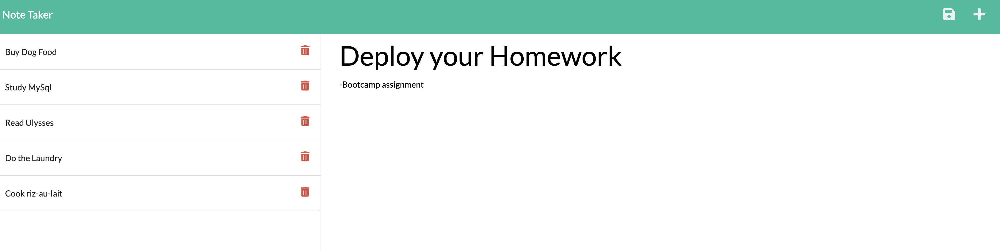
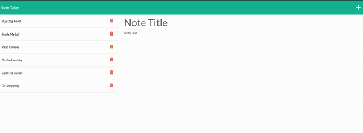

# note-taker

## Deployed Application: https://note-taker-banu.herokuapp.com/

## Description

This is a note-taker built with node.js and express.  Users are able to write and save notes, as well as delete notes. 

## Screenshot

## Installation and Running the Application

You can run this app on Heroku. There is a link for the deployed application.

If you are going to clone the app, here is the directions to install:

Steps required to install project and how to get the development environment running:

First run **npm install** in order to install the following npm package dependencies in the package.json:

- <i>inquirer</i> that will prompt you for your inputs from the command line
- <i>express</i> back end web application framework for Node. js 

Invoke the application with **node server.js**. Follow the port information.

## Usage

When user opens the application, presented with a landing page. 
User clicks on the link and opens the note-taker page. Enters a new note title and a note's text, then a save icon appears on the top of the page. When saved, note appears in the list on the left-side. Also list items can be deleted with the thrash-icon button.

## Credits and Libraries

 [npmjs.com-Express](https://www.npmjs.com/package/express)

 [expressjs.com- Express.js Guide](https://expressjs.com/)

 [mozzilla.org-Express.js Framework](https://developer.mozilla.org/en-US/docs/Learn/Server-side/Express_Nodejs)

 ## Contact Me
For any question about the project, please contact me.
[BanuAyozturk](mailto:bnyksl@gmail.com)

